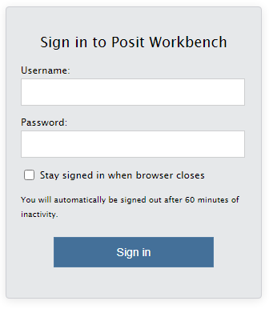

#### **Instructor Information** 

Dr. Jill E. Thomley 
Walker Hall 228 
828-773-3273 
thomleyje@appstate.edu 
<https://jillthomley.github.io/>

#### **Bulletin Description**  

STT2860 is an introduction to the tools, methods, and current practices of data management and visualization including reproducible work flow. Topics include introductory concepts of programming and work flow, data manipulation, and data visualization using grammar of graphics. Emphasis will also be placed on the practice of creating reproducible research using a version control system with dynamic document reporting, including technology/tools such as R, R Studio, R Markdown, Git, and Git Hub. 

Prerequisite: Demonstrated readiness for college-level math.

*This course does not assume you have previous experience with any of the methods or technologies above.* However, you should be comfortable using a computer and have reasonable access to a computer and internet connection outside of class. All required software and digital textbooks are provided free of charge, so there are no additional costs.

#### **Course Objectives**

1. Students will learn to use a reproducible research workflow.
2. Students will learn to collaborate effectively to solve problems.
3. Students will develop their expertise with data science technology.
4. Students will develop skills in programming, iteration, and sequencing.
5. Students will learn how to read data in various formats and write to a file.
6. Students will learn to manipulate, clean, code, and store data in a tidy format.
7. Students will learn to visualize data and models using the grammar of graphics.
8. Students will learn about data scientists, related organizations, and career paths.

#### **Class Meetings**

* We will meet Tuesdays and Thursdays from 3:30pm to 4:45pm in Walker 307B.

As stated in the ASU Undergraduate Bulletin, "class attendance is an important part of a student’s educational experience. Students are expected to attend every meeting of their classes and are responsible for class attendance. Regardless of what reasons there may be for absence, students are accountable for all academic activities, and faculty may require special work or tests to make up for the missed class or classes." 

Our face to face time is only 2.5 hours (sometimes less) each week, so it is important that your attention be focused on what we are doing in class. There are some additional guidelines to help facilitate the face-to-face learning experience for you and your peers.

* Participate fully in all active learning activities, both alone and in groups.
* Be ready to participate when class starts (e.g., notebooks and materials out).
* Do not pack up at the end of class until I am finished teaching and dismiss you.
* Put away phones. Do not text, check email, surf the web, or do other coursework.

#### **Student Help Hours** 

* Tuesday: 12:30pm to 01:30pm (in my office and Zoom)
* Wednesday: 02:00pm to 03:00pm (via Zoom only)
* Thursday: 12:30pm to 01:30pm (in my office and Zoom)
* Friday: 12:00pm to 01:30pm (via Zoom only)
* *I may schedule student appointments at other times, if needed.* 

I will be available on Zoom during all posted office hours. You may drop in or [book an appointment](https://calendar.google.com/calendar/u/0/selfsched?sstoken=UU0zQUk4blgtNW44fGRlZmF1bHR8Y2EyZDZmYTMxNmZjMWEwMjdiMzE0ZjQ1MmEwNDFjMmE). Appointments will take priority over drop-ins in terms of time. You may find yourself in a Zoom waiting room if I am interacting with an appointment, but I *will* get to you.

**Title IX Information Disclosure:** I care about you inside and outside of my classroom, and I want you to get the help and support you need. Given my role as an instructor at Appalachian State University, you should be informed about your choices regarding disclosure of sensitive information. If a student tells an instructor that they have experienced an act of interpersonal violence, then that faculty member is **required** to report it to the campus Title IX Coordinator. If you prefer to speak to someone who can keep your conversations confidential, I recommend the Counseling Center (828-262-3180, https://counseling.appstate.edu/). They also offer walk-in and after-hours coverage.

**Other Assistance:** I urge any student who has difficulty affording groceries or accessing sufficient food to eat every day, or who lacks a safe and stable place to live, to contact the Dean of Students (https://deanofstudents.appstate.edu/) for assistance and support. The Mountaineer Food Hub & Free Store (https://sustain.appstate.edu/initiatives/food-pantry/) is a free resource with pantry and personal care items. See the **Campus Resources for Students** link on our AsULearn page for more resources available to ASU students.

#### **Communication**  

* I will use the Course Announcements forum on our AsULearn site to send out announcements and course information. You are responsible for knowing the content of all postings, in addition to anything I say in class. 
* Except for extreme emergencies, all written communication must be handled through your Private Forum on AsULearn. I prefer this method because it stores all course-related messages and conversations in a place where we can easily access them throughout the semester. Like e-mail, you can include images and attachments. These forums keep my student/class communications separate from the rest of my email and provide notifications in AsULearn&mdash;a system I have found to be more effective over the past few years. 
* Monday through Friday, I will check our AsULearn Private Forums for messages at least once per day between the hours of 10am and 7pm. I may check more than once on weekdays, since I am often on AsULearn grading or updating. I typically will check at least once on Saturdays, depending on my weekend schedule. Please do not expect replies on Sundays.

#### **Assessment & Grading**

[AsULearn](https://asulearn.appstate.edu/) contains more detailed information about assignments. 

The only way to learn data science is to **DO** data science, which includes software such as RStudio and GitHub. Reading the textbook, learning the language, and practicing exercises using real data are critical to your learning and success. Class activities and formative/summative assessments have been structured with these principles in mind. It will be easier to participate if you acquire some familiarity with the vocabulary and methods before we start to discuss and use them. You must "speak the language" of data science (grammar of graphics, tidy data, R, RStudio, Git, GitHub, etc.) to effectively demonstrate your knowledge.  

* DataCamp (40%)
* Homework (20%)
* Project 01 (15%)
* Project 02 (20%)
* Presentation (5%)

##### **DataCamp Skill-Building** 

Using a series of interactive, web-based courses, you will learn and practice data manipulation, visualization, analysis, and reporting skills in R. Access to [DataCamp](https://learn.datacamp.com/) is free during the semester after you accept the invitation to join our group. Grading will be credit (1)/no credit (0). You will get credit for an assignment if you earn 80% or more of the available points (XP) for the assignment. If you miss a due date, you can complete a 2nd Chance Opportunity, where you will get credit for earning 90% or more XP. 

##### **Homework Assignments** 

I will assign homework periodically throughout the semester to help you develop and practice your emerging skills. This typically will be an online "quiz" or a programming assignment that you will complete using R and submit as a compiled R Markdown document. In some cases we may use the Workshop tool in AsULearn for peer evaluation and feedback. You are welcome to compare programming approaches, methods, and answers with your peers---in fact, I encourage it. However, everyone must submit their own assignment. 

##### **Data Science Projects** 

Group projects will require you to integrate and solidify your data science skills by applying them to analysis and visualization of real-world data. It will also allow you to practice the kind of teamwork skills data scientists need to have. You will work in small groups of 3 or 4 students for part of each project and submit that work as a group. For at least one project you will craft and submit an analysis plan that explains each person's duties and commitment to the project, as well as conduct peer evaluations. There will be two projects. 

##### **Final Presentation** 

You will do an individual presentation of data visualizations during our class final exam period. You will be required to use methods learned in this class, including R Markdown slides (rather than PowerPoint or Google Slides).

##### **Grading Scale** 

This course will use the standard 10-point +/- grading scale (93--100 = A, 90--92 = A--, 87--89 = B+, etc.) to determine final grades. I do not round up, given all the second-chance opportunities built into the course. Accommodations *may* be made for documented extenuating circumstances that prevent you from completing work early/on time. Grades will be kept on [AsULearn](https://asulearn.appstate.edu/). You should monitor your grades throughout the term to make sure they are complete and accurate. Contact the instructor via your Private Forum or office hours if you have questions.   

##### **Academic Integrity**

Appalachian's [Academic Integrity Code](https://academicintegrity.appstate.edu/) is designed to create an atmosphere of trust, respect, fairness, honesty, and responsibility. All members of the ASU community are responsible for promoting an ethical learning environment. Students attending ASU agree to abide by the following:

* Students will not lie, cheat, or steal to gain academic advantage.
* Students will oppose every instance of academic dishonesty.

By submitting work under your name, you are attesting that you have abided by the Academic Integrity Code. Violations of Academic Integrity will be treated very seriously. [Penalties](https://academicintegrity.appstate.edu/pagesmith/13) can include a reduced grade for the assignment or course, course, academic probation, or expulsion.

#### **Course Materials**

##### **Required Textbooks**

Primary Textbooks

* [Introduction to Data](http://rafalab.dfci.harvard.edu/dsbook/) Science (IDS) by Rafael A. Irizarry (free, web-based)
* [R Programming for Data Science](https://bookdown.org/rdpeng/rprogdatascience/) by Roger Peng (free, web-based)
* [R Markdown: The Definitive Guide](https://bookdown.org/yihui/rmarkdown/) by Yihui Xie, J. J. Allaire, and Garrett Grolemund (free, web-based)

We will use some other web-based texts, as well as a variety of web resources such as blogs, web pages and videos. All materials can be accessed via AsULearn. There is no rental system textbook for this class.

##### **Computers and Software**

This course will use the ASU RStudio server (https://mathr.appstate.edu/) that has the programs listed below (and more) installed. Note that all technology used in the class is either open source (free) or will be accessible to students enrolled in the course for no cost.

* [R](https://cran.r-project.org) 
* [RStudio](https://www.rstudio.com/products/rstudio/download/)
* [DataCamp](https://www.datacamp.com/)
* [Git](https://git-scm.com/downloads) 
* [GitHub](https://github.com)

You must have an active internet connection and be registered in the course to access the ASU RStudio server. To access the server, point any web browser to <https://mathr.appstate.edu/>. Use your Appstate Username and Password to log in. A screen shot of the RStudio server is shown below. If you have problems with your Appstate Username or Password visit [IT Support Services](http://support.appstate.edu/) or call 262-6266.

#### **Student Expectations**

##### **Engage with the Content**

Appalachian students are expected to make engagement with courses their first priority. Be proactive and take charge of your own learning! If you have not read/watched assigned materials or attempted problems and online programming modules before coming to class or office hours, you likely will be confused, feel lost, and have a terrible experience in this course. I DO NOT WANT THAT TO HAPPEN! Each of you has the capability to succeed. However, sometimes we must change certain behaviors, study habits, and/or emotional reactions. In this course, you will be challenged with concepts and problems you have never seen before. I do not expect you to be able to understand them all immediately. A critical first step in learning new material is seeing what you can do on your own. This may feel uncomfortable and frustrating. Success in data science is not based on whether it "comes naturally" to you or whether a topic seems “clear” the first time you are introduced to it. Instead, success is about learning to use mistakes and material we may be struggling with in order to grow. You will see that even I struggle at times; there is always something new to learn, especially when it comes to computing in R. Each time we get stuck, it teaches us something about the problem we are working on and leads us to develop greater skill and better understanding of the content. 

##### **Communicate with Others**

Knowing what you can do on your own is important, but in the real world, people are not generally expected to work alone. In fact, teamwork is frequently required to achieve good outcomes. You will be expected to share with your peers to help develop your own and their proficiencies. I encourage you to talk to me and to your classmates in person or electronically even when you are not specifically assigned by me to do so. Asking questions and explaining things to others is one of the best ways to improve your understanding. Together we will create an environment in which everyone is respectful to one another and feels comfortable asking questions, making mistakes, and offering good guesses. Explore concepts and write out your thinking in a way that can be shared with others. Try everything that is asked of you, even if only to say, “I do not understand such and such” or “I am stuck here.” Be as specific as possible. *Consider. Conjecture*. I will try to give you hints and direction to help you understand. At times though, to encourage the exploration process, I may direct you to rethink a problem and then come back to discuss it with me  afterwards. This occurs when I believe that the struggle to understand is imperative for your deep understanding.  

##### **Invest Appropriate Time**

As per the University-wide Statement on Student Engagement with Courses (see University Policies below), you should expect to spend 2-3 hours on course work outside class for every hour you spend in class. **STT 2860 is a 3-credit course, which means course work and assessments are structured around 3 hours of class attendance and 6-9 hours of outside work per week.** All students are different, but I have used the [Rice Course Workload Estimator](https://cte.rice.edu/workload) and other tools to help estimate how long assigned course activities will take. If you find that you are spending fewer hours than these guidelines suggest, you can probably improve your understanding and grade by studying more. If you are consistently spending more hours than these guidelines suggest, you may be studying inefficiently; in that case, you should come see me to help identify where you can make some changes. Many students work during the school year to finance their educations; however, that does not change the requirements of this (or any) course. Budget your time accordingly and pace yourself to maximize your learning and achievement. 

##### **Get Yourself "Unstuck"**

It is typically easier to answer well-constructed questions than questions that are less specific, especially when it comes to statistical computing. The Stack Overflow thread [minimal R reproducible example](http://stackoverflow.com/questions/5963269/how-to-make-a-great-r-reproducible-example/5963610#5963610) discusses how to construct a question that helps someone else reproduce the issue about which you are seeking help. [How To Ask Questions The Smart Way](http://www.catb.org/~esr/faqs/smart-questions.html) by Eric Raymond and Rick Moen offers another useful perspective, which has been adapted in [this video](https://www.youtube.com/watch?v=ZFaWxxzouCY&list=PLjTlxb-wKvXNSDfcKPFH2gzHGyjpeCZmJ&index=3). Use instructor-provided resources, google for relevant solutions, seek help from your classmates, and/or come in to [office hours](https://jillthomley.github.io/schedule.html). While I can sometimes help via Private Forum message, face-to-face (Zoom for an online course) is typically best.

##### **Additional Class Policies**

This course conforms to all Appalachian State University policies with respect to academic integrity, disability services, and class attendance. The details of these policies may be found at <http://academicaffairs.appstate.edu/resources/syllabi>.

As per [AppalachianState University](https://diversity.appstate.edu/) and the [Department of Mathematical Sciences Statement on Diversity and Inclusiveness](https://mathsci.appstate.edu/diversity), I intend this class is to be a welcoming environment where everyone can learn and explore in order to achieve their full potential. As such, we all need to be respectful to each other in all interactions, regardless of gender, political party, race, religion, sexuality, disability, etc. This includes others' choices about COVID precautions, such as masks and social distancing in our physical classroom space. Activities that distract/disrupt your fellow students or the instructor may result in a lowered grade. First offenses typically will be dealt with by the instructor. Subsequent or serious behavior issues will be referred to the **Office of Student Conduct** (https://studentconduct.appstate.edu/).

Updated Tuesday, August 15, 2023 @ 06:48 PM
