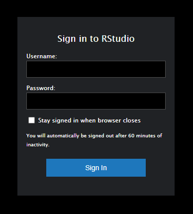

#### **Instructor Information**  

**Instructor:**    Dr. Jill E. Thomley  
**Pronouns:**      she/her/hers  
**E-Mail:**        thomleyje@appstate.edu  
**Office Hours:**  [My Schedule](https://jillthomley.github.io/schedule.html)

* Monday: I will check Private Forum messages
* Tuesday: 12:00 – 1:00pm via Zoom
* Wednesday: 12:00 – 1:00pm and 6:00 – 7:00pm via Zoom
* Thursday: 12:00 – 1:00pm via Zoom
* Friday: I will check Private Forum messages
* Saturday: I will (usually) check Private Forum messages
* Sunday: N/A
* *I may schedule student appointments at other times, if needed.* 

I will be available on Zoom during all posted office hours. You may drop in or [book an appointment](https://calendar.google.com/calendar/u/0/selfsched?sstoken=UU0zQUk4blgtNW44fGRlZmF1bHR8Y2EyZDZmYTMxNmZjMWEwMjdiMzE0ZjQ1MmEwNDFjMmE). Appointments take priority over drop-ins in terms of time. You may find yourself in a waiting room if I am interacting with an appointment, but I *will* get to you. 

**Meeting Times**

This is a 100% web-based class. We will meet via Zoom.

* Tuesday: 3:30pm – 4:45pm (synchronous class in Zoom)
* Thursday: 3:30pm – 4:45pm (synchronous class in Zoom)
* Physical classroom space: Walker Hall 307B computer lab

Class will be held via Zoom, but you can use our classroom during class. You will need to bring your own headphones if you exercise this option. I will assess student use of the physical space during the semester to determine whether it continues to be an option (per my department).

**Communication**  

I will use the **Course Announcements** forum on [AsULearn](https://asulearn.appstate.edu/) to send out announcements and course information, with **Remind** as a supplement. You are responsible for knowing the content of all postings, in addition to anything I say in class. **Except for extreme emergencies, all written communication must be handled through your Private Forum on [AsULearn](https://asulearn.appstate.edu/).** I prefer this method because it stores all exchanges in a place where we can easily access them and it keeps my class communications separate from the rest of my email. Monday through Friday, I will check forums for messages at least once per day between 10am and 7pm. Often I will check more than once on weekdays. I typically will check at least once on Saturdays. Do not expect replies on Sundays.

**Description**  

An introduction to the tools, methods, and current practices of data management and visualization including reproducible work flow. Topics include introductory concepts of programming and work flow, data manipulation, and data visualization using grammar of graphics. Emphasis will also be placed on the practice of creating reproducible research using a version control system with dynamic document reporting, including technology/tools such as R, R Studio, R Markdown, Git, and Git Hub. 

Prerequisite: demonstrated readiness for college-level math.

*This course does not assume you have previous experience with any of the methods or technologies above.* However, you should be comfortable using a computer and have reasonable access to technology outside of class.

**Objectives**

1. Students will learn to use a reproducible research workflow.
2. Students will develop their data science technology expertise.
3. Students will develop skills in programming, iteration, and sequencing.
4. Students will learn how to read data in various formats and write to a file.
5. Students will learn to manipulate, clean, code, and store data in a tidy format.
6. Students will learn to visualize data and models using the grammar of graphics.
7. Students will learn about data scientists, related organizations, and career paths.

**Assessment and Grading**

The only way to learn data science is to **DO** data science, which includes software such as RStudio and GitHub. Reading the textbook, learning the language, and practicing exercises using real data are critical to your learning and success. Class activities and formative/summative assessments have been structured with these principles in mind. It will be easier to participate if you acquire some familiarity with the vocabulary and methods before we start to discuss and use them. You must "speak the language" of data science (grammar of graphics, tidy data, R, RStudio, Git, GitHub, etc.) to effectively demonstrate your knowledge.  

* DataCamp Skill-Building (35%)
* DataCamp Elective Depth (5%)
* Homework Assignments (20%)
* Group Projects/Presentation (40%)

**DataCamp:** Using a series of interactive, web-based courses, you will learn and practice data manipulation, visualization, analysis, and reporting skills in R. In addition, you will explore an area of your choice in greater depth. Access to [DataCamp](https://learn.datacamp.com/) is free during the semester after you accept an invitation to join our course. Grading is credit (1)/no credit (0). You will receive credit for an assignment if you earn 80% or more of the available points (XP) for the assignment. If you miss a due date on the weekly skill-building assignments, you can complete a second chance opportunity where you receive credit for earning 90% or more of the available XP. Elective depth assignments will allow you to choose from a set of courses to explore one or more areas of interest in greater detail. They will be self-paced and due near the end of the semester.

**Homework:** I will assign homework periodically throughout the semester to help you develop and practice your emerging skills. This typically will be an online discussion or an assignment that you will complete using R code and submit as a compiled R Markdown document. In some cases we will use the Workshop tool in AsULearn for peer feedback. You are welcome to compare methods and answers with peers; in fact, I encourage it. However, everyone must submit their own assignment. 

**Projects:** Group projects will allow you to integrate and solidify the data science skills you learn in this course by applying them to the analysis and visualization of real-world data. It will also allow you to practice the kind of teamwork skills data scientists need to have. You will work in small groups of 3 or 4 students for each project and submit your work as a group. For at least one project you will be asked to submit an analysis plan that explains each person's duties and commitment to the project, as well as conduct peer evaluations. There will be a total of two group projects. The second will involve a group presentation during our class final exam period.

[AsULearn](https://asulearn.appstate.edu/) contains additional information about assignments. 

This course will use the standard 10-point +/- grading scale (93--100 = A, 90--92 = A--, 87--89 = B+, etc.) to determine final grades. I do not round up, given all the second-chance opportunities built into the course. Accommodations *may* be made for documented extenuating circumstances that prevent you from completing work early/on time. Grades will be kept on [AsULearn](https://asulearn.appstate.edu/). You should monitor your grades throughout the term to make sure they are complete and accurate. Contact the instructor via your Private Forum or office hours if you have questions.   

**Required Textbooks**

* Ismay, C. and Kim, A.Y. [_Modern Dive: Statistical Inference via Data Science_](https://moderndive.com/index.html). (free, web-based)
* Garrett Grolemund & Hadley Wickham. [_R for Data Science_](http://r4ds.had.co.nz/). (free, web-based)
* Kabacoff, Rob.[_Data Visualization with R_](https://rkabacoff.github.io/datavis/) (free, web-based)
* Peng, Roger D. [_R Programming for Data Science_](https://bookdown.org/rdpeng/rprogdatascience/) (free, web-based)

We will use small portions of a few other web-based texts, as well as web resources. All readings may be accessed via AsULearn.

**Computers and Software**

This course will use the RStudio server  (https://mathr.math.appstate.edu/) that has the programs listed below (and more) installed. Note that all technology used in the class is either open source (free) or will be accessible to students enrolled in the course for no cost.

* [R](https://cran.r-project.org) 
* [RStudio](https://www.rstudio.com/products/rstudio/download/)
* [DataCamp](https://www.datacamp.com/)
* [Git](https://git-scm.com/downloads) 
* [GitHub](https://github.com)

You must have an active internet connection and be registered in the course to access the ASU RStudio server. To access the server, point any web browser to <https://mathr.math.appstate.edu/>. Use your Appstate Username and Password to log in. A screen shot of the RStudio server is shown below. If you have problems with your Appstate Username or Password visit [IT Support Services](http://support.appstate.edu/) or call 262-6266.

**Engage with the Content**

Appalachian students are expected to make engagement with courses their first priority. Be proactive and take charge of your own learning! If you have not read/watched assigned materials or attempted problems and online programming modules before coming to class or office hours, you likely will be confused, feel lost, and have a terrible experience in this course. I DO NOT WANT THAT TO HAPPEN! Each of you has the capability to succeed. However, sometimes we must change certain behaviors, study habits, and/or emotional reactions. In this course, you will be challenged with concepts and problems you have never seen before. I do not expect you to be able to understand them all immediately. A critical first step in learning new material is seeing what you can do on your own. This may feel uncomfortable and frustrating. Success in data science is not based on whether it "comes naturally" to you or whether a topic seems “clear” the first time you are introduced to it. Instead, success is about learning to use mistakes and material we may be struggling with in order to grow. You will see that even I struggle at times; there is always something new to learn, especially when it comes to computing in R. Each time we get stuck, it teaches us something about the problem we are working on and leads us to develop greater skill and better understanding of the content. 

**Communicate with Others**

Knowing what you can do on your own is important, but in the real world, people are not generally expected to work alone. In fact, teamwork is frequently required to achieve good outcomes. You will be expected to share with your peers to help develop your own and their proficiencies. I encourage you to talk to me and to your classmates in person or electronically even when you are not specifically assigned by me to do so. Asking questions and explaining things to others is one of the best ways to improve your understanding. Together we will create an environment in which everyone is respectful to one another and feels comfortable asking questions, making mistakes, and offering good guesses. Explore concepts and write out your thinking in a way that can be shared with others. Try everything that is asked of you, even if only to say, “I do not understand such and such” or “I am stuck here.” Be as specific as possible. *Consider. Conjecture*. I will try to give you hints and direction to help you understand. At times though, to encourage the exploration process, I may direct you to rethink a problem and then come back to discuss it with me  afterwards. This occurs when I believe that the struggle to understand is imperative for your deep understanding.  

**Invest Appropriate Time**

As per the University-wide Statement on Student Engagement with Courses (see University Policies below), you should expect to spend 2-3 hours on course work outside class for every hour you spend in class. **STT 2860 is a 3-credit course, which means course work and assessments are structured around 3 hours of class attendance and 6-9 hours of outside work per week.** All students are different, but I have used the [Rice Course Workload Estimator](https://cte.rice.edu/workload) and other tools to help estimate how long assigned course activities will take. If you find that you are spending fewer hours than these guidelines suggest, you can probably improve your understanding and grade by studying more. If you are consistently spending more hours than these guidelines suggest, you may be studying inefficiently; in that case, you should come see me to help identify where you can make some changes. Many students work during the school year to finance their educations; however, that does not change the requirements of this (or any) course. Budget your time accordingly and pace yourself to maximize your learning and achievement. 

**Get Yourself "Unstuck"**

It is typically easier to answer well-constructed questions than questions that are less specific, especially when it comes to statistical computing. The Stack Overflow thread [minimal R reproducible example](http://stackoverflow.com/questions/5963269/how-to-make-a-great-r-reproducible-example/5963610#5963610) discusses how to construct a question that helps someone else reproduce the issue about which you are seeking help. [How To Ask Questions The Smart Way](http://www.catb.org/~esr/faqs/smart-questions.html) by Eric Raymond and Rick Moen offers another useful perspective, which has been adapted in [this video](https://www.youtube.com/watch?v=ZFaWxxzouCY&list=PLjTlxb-wKvXNSDfcKPFH2gzHGyjpeCZmJ&index=3). Use instructor-provided resources, google for relevant solutions, seek help from your classmates, go to the [Math Tutoring Lab](https://mathsci.appstate.edu/academics/math-tutoring), and/or come in to [office hours](https://jillthomley.github.io/schedule.html). While I can sometimes help via Private Forum message, face-to-face (Zoom for an online course) is typically best.

**Additional Policies**

Any student who has difficulty affording groceries or accessing sufficient food to eat every day, or who lacks a safe and stable place to live, and who believes this may affect their performance in the course, is urged to contact the Dean of Students, 324 Plemmons Student Union, for a list of resources and support. The ASU Food Pantry and Free Store, which is located in the Office of Sustainability on the bottom floor of East Hall,  is a free resource with pantry and personal care items. See the **ASU Student Services** link on our [AsULearn](https://asulearn.appstate.edu/) page for more resources and a statement regarding the confidentiality (or not) of personal information you may choose to share with me.

This course conforms with all Appalachian State University policies with respect to academic integrity, disability services, and class attendance. The details of these policies may be found at <http://academicaffairs.appstate.edu/resources/syllabi>.

As stated in the ASU Undergraduate Bulletin, students are expected to attend all course meetings and are completely responsible for their own attendance. Any student who is absent for any reason is completely responsible for all material covered in class.

Our "face to face" time is limited, so it is important that your attention is not divided. There are some additional rules to help facilitate the face-to-face (i.e., Zoom) learning experience for both you and your peers:

* Be ready to participate when class starts (e.g., notebooks and materials out).
* Do not pack up at the end of class until I am finished teaching and dismiss you.
* Put away phones during class. Do not check email, surf the web, or do other coursework.

As per [AppalachianState University](https://diversity.appstate.edu/) and the [Department of Mathematical Sciences Statement on Diversity and Inclusiveness](https://mathsci.appstate.edu/diversity), I intend this class is to be a welcoming environment where everyone can learn and explore in order to achieve their full potential. As such, we all need to be sensitive and respectful to each other in all interactions, regardless of gender, political party, race, religion, sexuality, disability, etc. **This includes taking proper COVID precautions, such as well-fitting masks worn at all times if you choose to use the physical classroom space.** Activities that distract/disrupt your fellow students or the instructor may result in a lowered grade. First offenses typically will be dealt with by the instructor. Subsequent or serious behavior issues will be referred to the [Office of Student Conduct](https://studentconduct.appstate.edu/).

Updated Monday, January 10, 2022 @ 09:15 PM
